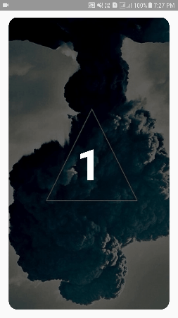
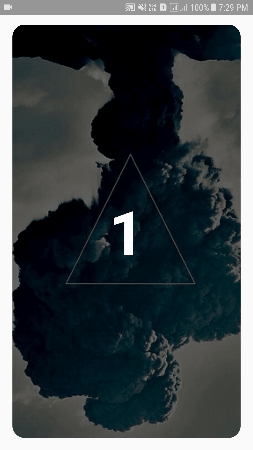

# ViewPagerTransformations

<a href="">
  
</a>

* Simple Transformation


* [Depth Transformation](https://github.com/dipanshukr/ViewPagerTransformations/wiki/Depth-Transformation)


```java
@Override
    public void transformPage(View page, float position) {
        if (position < -1){    // [-Infinity,-1)
            page.setAlpha(0);
        } else if (position <= 0){    // [-1,0]
            page.setAlpha(1);
            page.setTranslationX(0);
            page.setScaleX(1);
            page.setScaleY(1);
        } else if (position <= 1){    // (0,1]
            page.setTranslationX(-position*page.getWidth());
            page.setAlpha(1-Math.abs(position));
            page.setScaleX(1-Math.abs(position));
            page.setScaleY(1-Math.abs(position));
        } else {    // (1,+Infinity]
            page.setAlpha(0);
        }
    }
```

* [Zoom Out Transformation](https://github.com/dipanshukr/ViewPagerTransformations/wiki/Zoom-Out-Transformation)


```java
@Override
    public void transformPage(View page, float position) {
        if (position <-1){  // [-Infinity,-1)
            page.setAlpha(0);
        } else if (position <=1){ // [-1,1]
            page.setScaleX(Math.max(0.65f,1-Math.abs(position)));
            page.setScaleY(Math.max(0.65f,1-Math.abs(position)));
            page.setAlpha(Math.max(0.3f,1-Math.abs(position)));
        } else {  // (1,+Infinity]
            page.setAlpha(0);
        }
    }
```

### 
### [Clock Spin Transformation](https://github.com/dipanshukr/ViewPagerTransformations/wiki/Clock-Spin-Transformation)


### [AntiClock Spin Transformation](https://github.com/dipanshukr/ViewPagerTransformations/wiki/AntiClock-Spin-Transformation)


### [Fidget Spin Transformation](https://github.com/dipanshukr/ViewPagerTransformations/wiki/Fidget-Spin-Transformation)


### [Vertical Flip Transformation](https://github.com/dipanshukr/ViewPagerTransformations/wiki/Vertical-Flip-Transformation)


### [Horizontal Flip Transformation](https://github.com/dipanshukr/ViewPagerTransformations/wiki/Horizontal-Flip-Transformation)


### [Pop Transformation](https://github.com/dipanshukr/ViewPagerTransformations/wiki/Pop-Transformation)


### [Fade Out Transformation](https://github.com/dipanshukr/ViewPagerTransformations/wiki/Fade-Out-Transformation)


### [Cube Out Transformation](https://github.com/dipanshukr/ViewPagerTransformations/wiki/Cube-Out-Transformation)


### [Cube In Transformation](https://github.com/dipanshukr/ViewPagerTransformations/wiki/Cube-In-Transformation)


### [Cube Out Scaling Transformation](https://github.com/dipanshukr/ViewPagerTransformations/wiki/Cube-Out-Scaling-Transformation)


### [Cube In Scaling Transformation](https://github.com/dipanshukr/ViewPagerTransformations/wiki/Cube-In-Scaling-Transformation)


### [Cube Out Depth Transformation](https://github.com/dipanshukr/ViewPagerTransformations/wiki/Cube-Out-Depth-Transformation)


### [Cube In Depth Transformation](https://github.com/dipanshukr/ViewPagerTransformations/wiki/Cube-In-Depth-Transformation)


### [Hinge Transformation](https://github.com/dipanshukr/ViewPagerTransformations/wiki/Hinge-Transformation)


### [Gate Transformation](https://github.com/dipanshukr/ViewPagerTransformations/wiki/Gate-Transformation)


### [Toss Transformation](https://github.com/dipanshukr/ViewPagerTransformations/wiki/Toss-Transformation)


### [Fan Transformation](https://github.com/dipanshukr/ViewPagerTransformations/wiki/Fan-Transformation)

